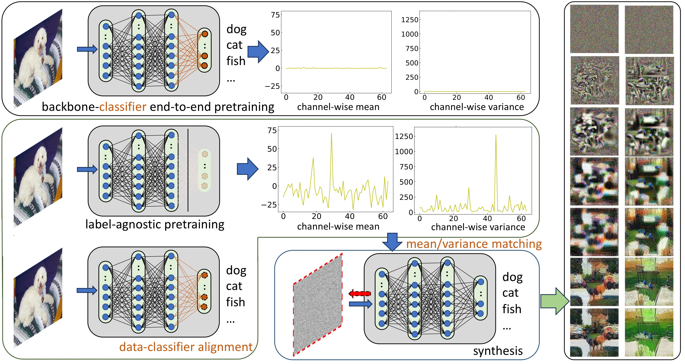

# Self-supervised Compression Method for Dataset Distillation 


## Abstract
Dataset distillation aims to *compress* information and knowledge from a large-scale original dataset to a new compact dataset while striving to preserve the utmost degree of the original data's informational essence. Previous studies have predominantly concentrated on aligning the intermediate statistics between the original and distilled data, such as weight trajectory, features, gradient, BatchNorm, etc. 

In this work, we consider addressing this task through the new lens of **model informativeness** in compression on the original dataset pretraining. We observe that with the prior state-of-the-art SRe&sup2;L, as model sizes increase, it becomes increasingly challenging for supervised pretrained models to retrieve learned information during data synthesis, as the channel-wise mean and variance inside the model are flatting and less informative. Building on this observation, we introduce SC-DD, a **S**elf-supervised **C**ompression method for **D**ataset **D**istillation that facilitates diverse information compression and recovery compared to traditional supervised learning schemes, further reaps the potential of large pretrained models with enhanced capabilities. 

Extensive experiments are conducted on CIFAR-100, Tiny-ImageNet and ImageNet-1K datasets to demonstrate the superiority of our proposed approach. The proposed SC-DD outperforms all previous state-of-the-art supervised dataset distillation methods when employing larger models, such as SRe&sup2;L, MTT, TESLA, DC, CAFE, etc., by large margins. 



## Experiments
### Recover
```
python data_synthesis.py \
    --arch-name "resnet50" \
    --exp-name "recover_resnet50_ipc50" \
    --pretrained "/your/pretrained_model.pth.tar" \
    --syn-data-path './syn_data' \
    --first-bn-multiplier 10 \
    --batch-size 50 \
    --lr 0.1 \
    --iteration 1000 \
    --l2-scale 0 --tv-l2 0 --r-bn 0.01 \
    --verifier --store-best-images \
    --index-start 0 \
    --index-end 50 
```
### Validation
```
python train_kd.py \
    --wandb-project 'select_policy_random' \
    --batch-size 64 \
    --model resnet18 \
    --teacher-model resnet18 \
    --epochs 1000 \
    --cos \
    -j 8 --gradient-accumulation-steps 1 \
    -T 20 \
    --mix-type 'cutmix' \
    --val-dir /your/path/imagenet/val \
    --train-dir /your/synthesis_data_path \
    --output-dir ./save \
    --image-select-idx 0 \
```
## Performance
| IPC | CIFAR-100 | Tiny-ImageNet | ImageNet-1K |
|---|---|---|---|
| 10 img/cls | - | 31.6 | 32.1 |
| 50 img/cls | 53.4 | 45.9 | 53.1 |
| 100 img/cls | - | - | 57.9 |
| 200 img/cls | - | - | 63.5 | 

Table 1: Top-1 validation accuracy trained from 10, 50, 100, 200 synthetic image(s)/class with ResNet18.

